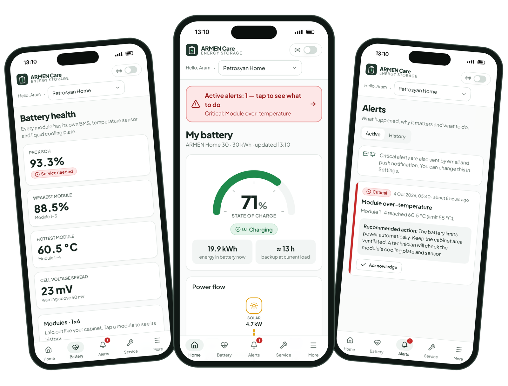
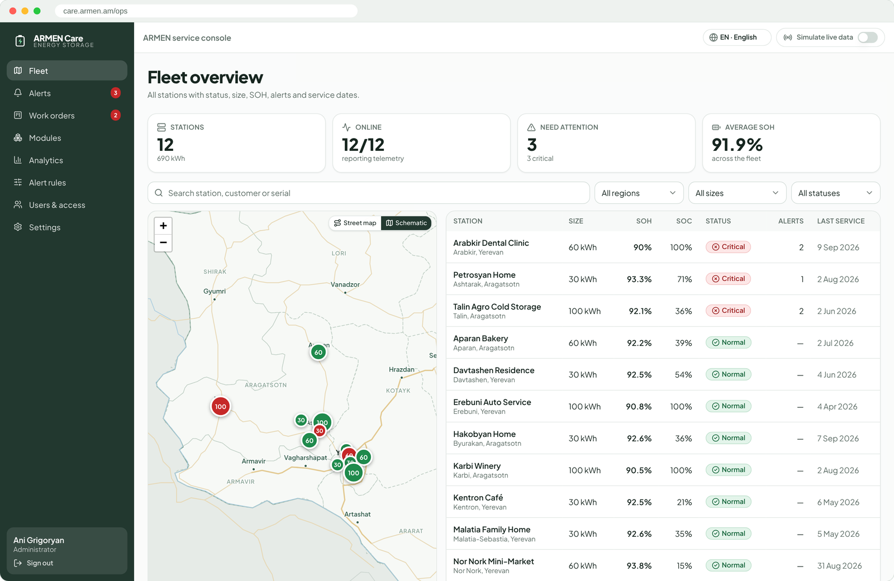
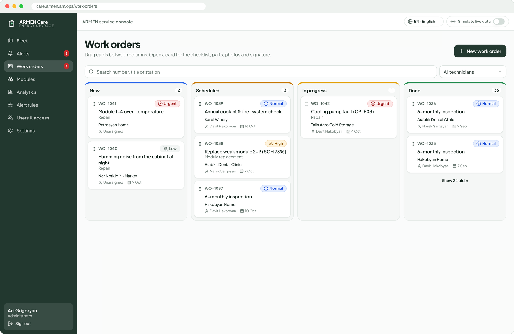

# ARMEN Care

Maintenance and monitoring app for ARMEN home and small-business battery storage stations in Armenia (LFP, 30 / 60 / 100 kWh modular cabinets).

* **Owners** see the health of their battery, get alerts, read monthly savings reports and book service (mobile-first).
* **Technicians** see their assigned stations, work orders, checklists and module replacements (desktop-first).
* **Admins** see the whole fleet, manage users, stations and alert thresholds, and read the analytics.



| Fleet map (admin) | Work orders (technician) |
|---|---|
|  |  |

Stack: React 18 + TypeScript + Vite, Tailwind + shadcn/ui-style components (Radix), Recharts, React Query, i18next (Armenian is the default, plus English and Russian), Leaflet, Supabase (Auth, Postgres + RLS, Storage, Realtime, Edge Functions).

---

## 1. Run it in 1 minute (demo mode, no backend)

```bash
npm install
npm run dev          # http://localhost:5173
```

Without Supabase variables the app runs on an **in-browser demo backend**. It holds the same seeded dataset and enforces the same role rules as the database. Sign in with one click on the login screen:

| Role | Email | Sees |
|---|---|---|
| Owner | owner@demo.armencare.am | 2 stations (Ashtarak home 30 kWh with an overheating module, Oshakan guesthouse 60 kWh) |
| Technician | tech@demo.armencare.am | 6 Aragatsotn stations (tech2@… has the 6 Yerevan stations) |
| Admin | admin@demo.armencare.am | All 12 stations, users, alert rules |

Password for every demo account: `ArmenCare2026!`

Turn on **Simulate live data** in the header to stream new telemetry every 3 seconds. Alerts are raised and cleared live from the current rules. In demo mode, your changes reset when the page reloads.

`npm run build:demo` builds the whole app as one self-contained HTML file (`dist-demo/index.html`, hash routing) for sharing.

---

## 2. Connect Supabase

```bash
cp .env.example .env      # set VITE_SUPABASE_URL and VITE_SUPABASE_ANON_KEY
supabase link --project-ref <ref>
supabase db push          # runs supabase/migrations/*
supabase functions deploy ingest notify invite-user
supabase secrets set ALLOW_SIMULATION=true APP_URL=https://care.armen.am \
  RESEND_API_KEY=... NOTIFY_FROM="ARMEN Care <alerts@armen.am>" \
  VAPID_PUBLIC_KEY=... VAPID_PRIVATE_KEY=... VAPID_SUBJECT=mailto:support@armen.am \
  NOTIFY_WEBHOOK_SECRET=<random>
SUPABASE_URL=... SUPABASE_SERVICE_ROLE_KEY=... npm run seed     # add "-- --reset" to reseed
```

The seed script creates the demo users, 12 stations, 145 modules plus spares, 90 days of 15-minute telemetry, 12 months of daily roll-ups, alerts, work orders, service history and documents. At the end it prints one **gateway API key per station**.

Optional extras:

* **Communication-lost alerts.** Enable `pg_cron` and schedule `select public.check_comm_lost()` every 5 minutes. The SQL is at the bottom of `20261004000100_reference.sql`.
* **E-mail / push for alerts not created by ingest** (for example COMM_LOST). Add a Database Webhook on `public.alerts` INSERT that calls `/functions/v1/notify` with header `x-webhook-secret: <NOTIFY_WEBHOOK_SECRET>`.
* **Web Push.** Generate VAPID keys with `npx web-push generate-vapid-keys`. Put the public key in `VITE_VAPID_PUBLIC_KEY`. Users enable push in Settings, which registers `public/sw.js`.

### Role-based access

All rules live in Postgres (`20261004000000_schema.sql`). The frontend only queries.

* `can_see_station(id)` decides visibility: admin sees everything; a technician sees stations where `stations.technician_id = auth.uid()`; an owner sees stations whose customer has `owner_id = auth.uid()`.
* Guard triggers handle column-level rules:
  * Owners can only change `operating_mode` and `backup_reserve_pct`.
  * Owners can only acknowledge alerts.
  * Owner service requests are always created as *New* and unassigned.
  * Only admins can change roles.
* `replace_module()` is a security-definer RPC. Only staff can call it, and only for a station they can see.
* Storage objects are stored as `<station_id>/…` in private buckets (`photos`, `signatures`, `documents`) and are protected by the same station rule.

These policies were tested against Postgres (PGlite) with owner, technician and admin sessions.

---

## 3. Telemetry ingestion (real hardware)

`supabase/functions/ingest` is the only write path for telemetry. The station controller's MQTT/Modbus gateway POSTs JSON:

```http
POST https://<project>.supabase.co/functions/v1/ingest
x-device-key: armen-gw-…            # per-station key; only its SHA-256 is stored (stations.device_key_hash)
Content-Type: application/json
```

```jsonc
{
  "station_serial": "ARM-S30-2025-0101",
  "ts": "2026-10-04T10:15:00Z",        // optional, defaults to now
  "soc": 64.2, "mode": "charging",     // charging | discharging | idle | backup
  "pv_kw": 6.1, "load_kw": 1.4, "grid_kw": -0.2, "battery_kw": 4.9,   // grid: + import / - export; battery: + charge
  "voltage": 312.4, "current": 15.7,
  "coolant_in_temp": 22.1, "coolant_out_temp": 25.3, "cycles": 274.8,
  "systems": {
    "pump": { "status": "ok", "flow_lpm": 12.3 },
    "fire": { "state": "armed", "pressure_bar": 3.2 },
    "dc_isolator": "closed",
    "inverter": { "state": "ok", "code": null, "temp_c": 38.0 },
    "transformer": { "state": "ok", "temp_c": 41.0 }
  },
  "modules": [
    { "row": 1, "slot": 1, "serial": "AM5-25A-01000", "soc": 64.0, "soh": 94.6, "voltage": 52.3,
      "current": 15.7, "temperature": 27.4, "cell_min_mv": 3262, "cell_max_mv": 3281, "bms_fault": null }
  ]
}
```

You can also send `{ "readings": [ … ] }` with up to 200 readings in one request, which suits buffered uploads after a connection drop. For each reading the function:

1. writes station and module rows to `telemetry`;
2. updates the `station_latest` snapshot, which drives the dashboards over Realtime;
3. adds the interval's energy to the `station_daily` roll-up (savings in AMD are computed from the station's tariff);
4. checks every rule in `alert_rules`, opens, escalates or clears alerts, and sends e-mail and push for new critical alerts;
5. logs a `MODULE_SERIAL_MISMATCH` event when a module's serial doesn't match the registry.

Try it without hardware:

```bash
INGEST_URL=https://<project>.supabase.co/functions/v1/ingest DEVICE_KEY=<from seed output> \
STATION_SERIAL=ARM-S30-2025-0101 npm run simulate
```

In Supabase mode, the **Simulate live data** toggle posts the same payloads through `ingest` using the signed-in user's token (only when `ALLOW_SIMULATION=true`). Turn that setting off in production.

---

## 4. Data model

The tables you specified, plus a few that support them:

| Table | Purpose |
|---|---|
| `profiles` | User role (owner / technician / admin), language, notification preferences |
| `customers`, `stations` | Station size, model, serial, install date, address, GPS, warranty end, technician, operating mode, tariffs |
| `modules` | Serial, station, position (row/slot), grade, status (active / faulty / replaced / spare), initial SOH |
| `module_assignments` | **Traceability**: every install/removal with SOH and grade at install, SOH at removal, reason, work order |
| `telemetry` | Station rows (`module_id is null`) and module rows: soc, soh, voltage, current, temperature, coolant in/out, … |
| `station_latest` | Latest snapshot per station (Realtime source) |
| `station_daily`, `module_daily` | Daily roll-ups for 12-month charts and monthly reports |
| `alerts`, `alert_rules` | At most one open alert per code and module; editable thresholds |
| `work_orders`, `checklist_templates`, `checklist_items` | Kanban, digital checklists per service type, parts, photos, signature |
| `service_history`, `documents`, `event_log`, `push_subscriptions` | Supporting data |

Completing a work order (DB trigger) writes service history, moves the 6-month schedule forward and resolves the linked alert.

Seed volume: station telemetry every 15 minutes for 90 days. Module rows are every 15 minutes for the last 7 days and hourly before that (about 0.5 M rows), so the free tier is enough. Change this in `scripts/seed.ts`.

---

## 5. How the simulated data works

`src/lib/sim/model.ts` is a small physical model that gives the same output every time:

* solar output by Armenian latitude, season and daily cloud cover;
* load profiles for homes, shops, offices, cold storage and workshops;
* battery dispatch in self-consumption or backup-reserve mode, plus rare grid outages;
* LFP open-circuit voltage curve, per-module temperatures following the coolant, and cell spread;
* SOH loss of 0.1–0.2 % per month.

The browser demo, the Supabase seed and the gateway simulator all use this model, so they show identical numbers. The seeded scenarios:

* **Petrosyan Home (Ashtarak, 30 kWh)**: module 1-4 overheating (about 56 °C, critical).
* **Talin Agro Cold Storage (100 kWh)**: cooling pump fault (critical); module temperatures are rising.
* **Arabkir Dental Clinic (60 kWh)**: weak module 2-3 at 78 % SOH, with a replacement work order already scheduled.
* **Karbi Winery**: a module replaced 8 months ago, as a traceability example.
* **Resolved history**: comm loss, inverter E-207, fire-system pressure fault, grid outages.

**Remaining-life estimate**: a straight line is fitted through the daily SOH values (last 12 months, or since installation) and extended to 80 % SOH. The app explains this to owners.

---

## 6. Fleet map

The admin and technician fleet page shows every station on a map of Armenia. It has two layers:

* **Built-in map (always on).** Country and province borders, Lake Sevan, rivers, main roads and place names in Armenian, English and Russian. It is bundled with the app (`src/lib/map/`, about 130 KB of [Natural Earth](https://www.naturalearthdata.com/) public-domain data), so the map works offline, behind firewalls and inside the single-file demo.
* **Street map (optional).** OpenStreetMap tiles on top of the built-in map. If the tile server cannot be reached, the map switches back to the built-in view automatically. Users can switch between *Street* and *Schematic* in the map's corner; the choice is remembered.

| Variable | Default | Meaning |
|---|---|---|
| `VITE_MAP_TILE_URL` | OpenStreetMap | Tile URL template, e.g. `https://api.maptiler.com/maps/streets/{z}/{x}/{y}.png?key=...`. Set to `off` to use only the built-in map (no external requests). |
| `VITE_MAP_TILE_ATTRIBUTION` | OpenStreetMap credit | Attribution text required by your tile provider. |

Fonts (Plus Jakarta Sans, Noto Sans Armenian, Noto Sans) are also bundled via `@fontsource`, so the app makes no Google Fonts requests.

## 7. Project layout

```
src/
  lib/api/        Api interface + demo.ts (in-browser) + supabase.ts
  lib/sim/        model.ts (physics), dataset.ts (seed scenarios), payload.ts (gateway JSON)
  lib/map/        armenia-basemap.json (bundled map data), places.ts (hy/en/ru place names)
  i18n/           hy.ts (default) · en.ts · ru.ts (type-checked: a missing key fails the build)
  pages/owner/    Home, Battery health, Safety, Alerts, Service, Reports (PDF), Settings
  pages/ops/      Fleet map/list, Station detail, Work-order Kanban, Modules, Alerts, Rules, Analytics, Users
supabase/
  migrations/     schema + RLS + storage + realtime, checklist templates, roll-up function
  functions/      ingest · notify · invite-user · _shared/rules.ts (also used by the browser)
scripts/          seed.ts · simulate-gateway.ts
```

## 8. Before production

* Replace the placeholder support numbers and e-mail (`src/components/FireInstructions.tsx`, `OwnerSettings.tsx`). Check the emergency numbers (911 / 101) with the Armenian Rescue Service.
* Set real tariffs per station. The defaults are 48 ֏/kWh import and 30 ֏/kWh export credit.
* The seeded work-order titles and descriptions are English sample text. Everything else in the UI is translated. Have a native speaker review the Armenian and Russian copy.
* Street-map tiles come from OpenStreetMap by default. Their [tile usage policy](https://operations.osmfoundation.org/policies/tiles/) does not allow heavy commercial traffic, so set `VITE_MAP_TILE_URL` to your own provider (e.g. MapTiler, Stadia, Mapbox) before launch.

---

## 9. Put it on GitHub

```bash
# in the project folder (the zip already contains an initialised git repo with one commit)
git remote add origin https://github.com/<you>/armen-care.git
git branch -M main
git push -u origin main
```

* `.github/workflows/ci.yml` type-checks and builds the app on every push and pull request, and attaches the single-file demo (`dist-demo/index.html`) to each run.
* Never commit `.env`; it is in `.gitignore`. Put Supabase keys in your hosting provider's environment settings instead.
* To host the demo for free, enable GitHub Pages or drag `dist-demo/index.html` onto Netlify / Vercel. It needs no backend.
* Add a `LICENSE` file if you want others to be able to reuse the code (for example MIT); without one, the code is "all rights reserved".
