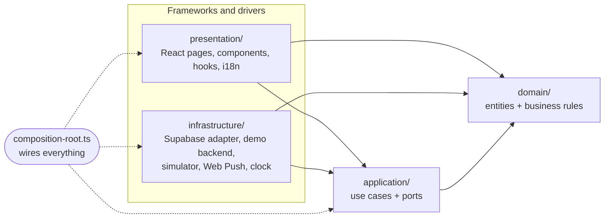
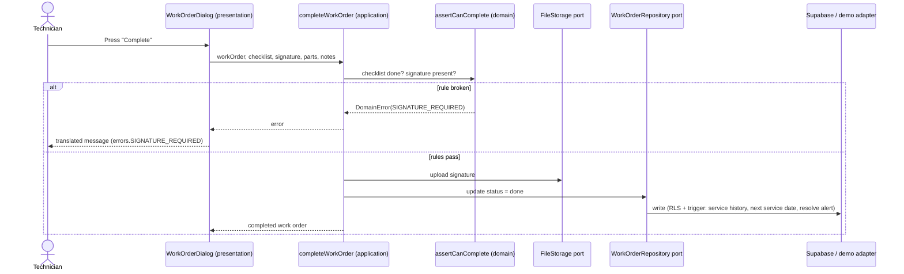

# ARMEN Care architecture

ARMEN Care follows **Clean Architecture**. Business rules sit in the middle and know nothing about React, Supabase, the browser or the database. Everything else plugs in around them.

## The dependency rule

Source code dependencies point **inwards only**.



| Layer | Folder | May import | Contains |
|---|---|---|---|
| Domain | `src/domain` | nothing (no npm packages either) | Entities (`model/`), business rules (`services/`), `DomainError` |
| Application | `src/application` | domain | Ports (interfaces the app needs), use cases, `createAppServices` |
| Infrastructure | `src/infrastructure` | domain, application | Adapters that implement the ports: Supabase, in-browser demo, physics simulator, Web Push, system clock |
| Presentation | `src/presentation` | domain, application | React UI. Gets the application through `ServicesProvider`, never imports adapters |
| Composition root | `src/composition-root.ts`, `src/main.tsx` | everything | Picks the backend (Supabase or demo) and builds the app once |

The rule is enforced automatically: `npm run lint:arch` runs [dependency-cruiser](https://github.com/sverweij/dependency-cruiser) with the rules in `.dependency-cruiser.cjs`, and CI fails on any violation (for example a React import in the domain, or a page importing the Supabase adapter).

## Folder map

```
src/
  domain/
    model/            Station, Module, Alert, WorkOrder, telemetry types · cabinet catalogue · default alert rules
    services/         pure functions holding the business rules
      station-health.ts        Good / Attention / Service · fleet status · module condition
      alert-rules.ts           alert evaluation + threshold validation (also runs in the Edge Function)
      battery-life.ts          remaining-life estimate (SOH trend to 80 %)
      work-order-lifecycle.ts  allowed moves, completion rules, priorities
      module-replacement.ts    serial / SOH / reason rules for swapping a module
      maintenance.ts           checklists, service intervals, next due dates
      station-settings.ts      backup reserve limits
      fleet.ts                 fleet overview rows
    errors/           DomainError with stable codes (translated in the UI)
  application/
    ports/            AuthPort, StationRepository, TelemetryPort, WorkOrderRepository, FileStorage, Clock, …
    use-cases/        auth · alerts · work-orders · modules · stations · users
    app-services.ts   queries (read side) + commands (use cases)
  infrastructure/
    supabase/         Supabase adapter (Postgres + RLS, Storage, Realtime, Edge Functions)
    demo/             in-browser backend with the same rules as the database
    simulation/       deterministic battery physics + demo dataset
    browser/          Web Push registrar
    system-clock.ts
  presentation/
    pages/ components/ hooks/ i18n/ lib/ providers/ styles/
  composition-root.ts
  main.tsx
```

## How a request flows: completing a work order



Every write in the UI goes through a use case like this one. Reads are simple queries passed straight to the read ports, so there is no boilerplate use case per list (see [ADR 0002](adr/0002-queries-and-commands.md)).

## Business rules live in one place

| Rule | Where |
|---|---|
| Owner health label: Service below 80 % SOH or a critical alert, Attention below 85 % or a warning | `domain/services/station-health.ts` |
| Station offline after 1 hour without telemetry | `domain/services/station-health.ts` |
| Alert thresholds and event alerts | `domain/services/alert-rules.ts` (browser **and** Edge Function) |
| Critical must be beyond warning in the rule's direction | `domain/services/alert-rules.ts` |
| Work orders: done only through completion, signature required, open checklist needs confirmation | `domain/services/work-order-lifecycle.ts` |
| Alert → work-order type and priority | `domain/services/work-order-lifecycle.ts` |
| Module swap: fresh serial, 80–100 % SOH, documented reason | `domain/services/module-replacement.ts` |
| Remaining life: least-squares SOH trend extended to 80 % | `domain/services/battery-life.ts` |
| 6-monthly inspection, annual coolant + fire check | `domain/services/maintenance.ts` |
| Backup reserve 10–80 % | `domain/services/station-settings.ts` |

Security rules (who may see or change what) are enforced by Postgres row-level security in Supabase and mirrored by the demo adapter. The domain does not replace them.

### One alert engine for browser and server

`src/domain/services/alert-rules.ts` has no imports, so the Supabase Edge Function (Deno) can run the same file. `npm run sync:shared` copies it to `supabase/functions/_shared/rules.ts`; a unit test fails if the two drift apart.

## Testing

```bash
npm test            # Vitest: domain rules and use cases (no browser, no database)
npm run lint:arch   # layer boundaries
npm run check       # type-check + tests + boundaries (what CI runs)
```

* `tests/domain/` tests the business rules as plain functions.
* `tests/application/` runs the use cases against in-memory fakes of the ports (`tests/application/fakes.ts`). This is what the ports make possible.
* `tests/architecture/` keeps the Edge Function's copy of the alert rules in sync.

## Adding a feature

1. **Rule first.** Put the business rule in `domain/services` as a pure function, with a test.
2. **Port.** If the feature needs something new from the outside world, add a method to the smallest fitting port in `application/ports`.
3. **Use case.** Write it in `application/use-cases`, taking ports as parameters. Test it with fakes.
4. **Adapters.** Implement the port method in both `infrastructure/supabase` and `infrastructure/demo`.
5. **UI.** Call it from a component with `useServices().commands…`, show errors with `errorMessage(e)`.
6. Run `npm run check`.

Decisions are recorded in [`docs/adr`](adr).
